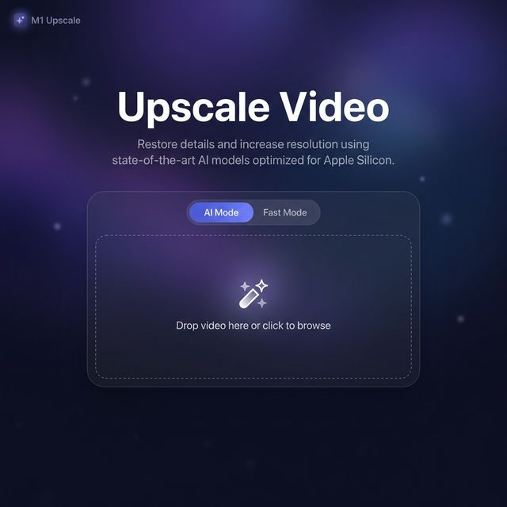
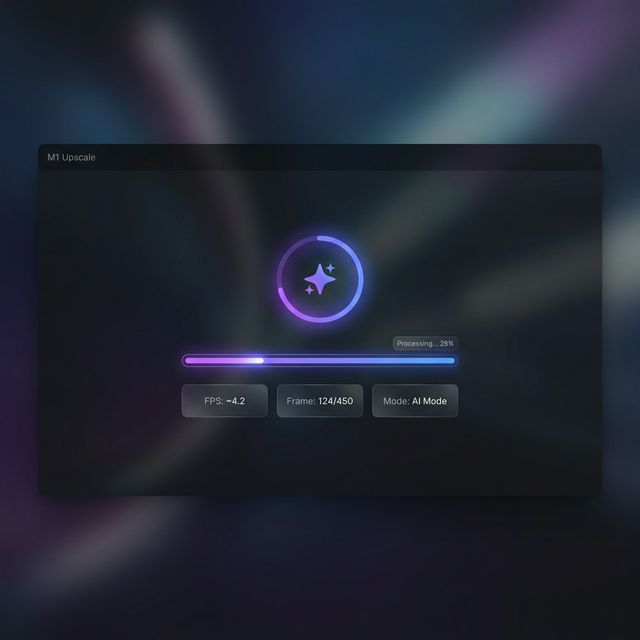
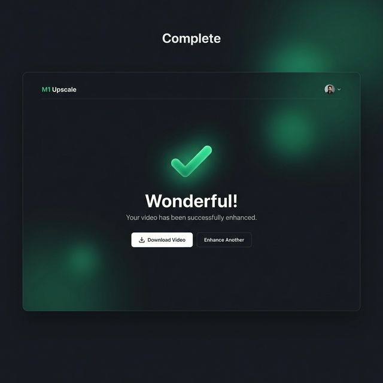

# 🚀 M1-Upscale-Engine

A professional-grade, local video upscaling application optimized for **Apple Silicon (M1/M2/M3)**. Leverage hardware-accelerated AI inference and video encoding to breathe new life into your videos.



## ✨ Features

- **AI-Powered Upscaling**: Uses Real-ESRGAN neural network to upscale videos with stunning clarity.
- **Apple Silicon Optimized**: Native support for **Metal Performance Shaders (MPS)** for lightning-fast GPU acceleration.
- **Hardware-Accelerated Encoding**: Utilizes **VideoToolbox (h264_videotoolbox)** for efficient, high-speed video rendering.
- **Real-time Monitoring**: Track progress frame-by-frame with a sleek, interactive dashboard.
- **Privacy First**: All processing is done locally on your device. Your videos never leave your machine.
- **Premium UI**: A modern, dark-mode interface built with **Next.js 14**, **Tailwind CSS**, and **Framer Motion**.

---

## 📸 Screenshots

````carousel

<!-- slide -->

<!-- slide -->

````

---

## 📋 Prerequisites

Ensure you have the following installed on your Mac:

- **macOS** with Apple Silicon (M1, M2, or M3)
- **Python 3.11** (required — Real-ESRGAN is incompatible with Python 3.13+)
- **Node.js 18+** & npm
- **FFmpeg** (with VideoToolbox support)

### Install FFmpeg via Homebrew
```bash
brew install ffmpeg
```

---

## 🛠️ Installation

### 1. Backend Setup (FastAPI)

```bash
cd backend

# Create virtual environment with Python 3.11 (required for Real-ESRGAN)
brew install python@3.11  # if not already installed
/opt/homebrew/opt/python@3.11/bin/python3.11 -m venv venv
source venv/bin/activate

# Install PyTorch with MPS support
pip3 install torch torchvision

# Install remaining dependencies
pip3 install -r requirements.txt
```

### 2. Frontend Setup (Next.js)

```bash
cd frontend

# Install dependencies
npm install
```

---

## 🚀 Getting Started

### Start the Backend
```bash
cd backend
source venv/bin/activate
python main.py
```
*Backend runs on `http://localhost:8000`*

### Start the Frontend
```bash
cd frontend
npm run dev
```
*Frontend runs on `http://localhost:3000`*

---

## 🏗️ Architecture

- **Backend**: FastAPI for robust API handling, PyTorch for AI inference via MPS, and FFmpeg for video processing.
- **Frontend**: Next.js 14 (App Router) for a responsive, high-performance user experience.
- **Model**: Real-ESRGAN for state-of-the-art single-image/frame super-resolution.

---

## 📝 License

Distributed under the MIT License. See `LICENSE` for more information.

## 🙏 Acknowledgments

- [Real-ESRGAN](https://github.com/xinntao/Real-ESRGAN)
- [BasicSR](https://github.com/XPixelGroup/BasicSR)
- Apple for Metal and VideoToolbox technologies.
